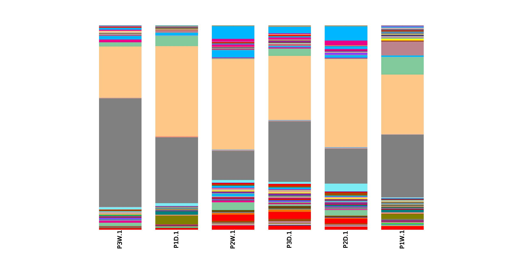
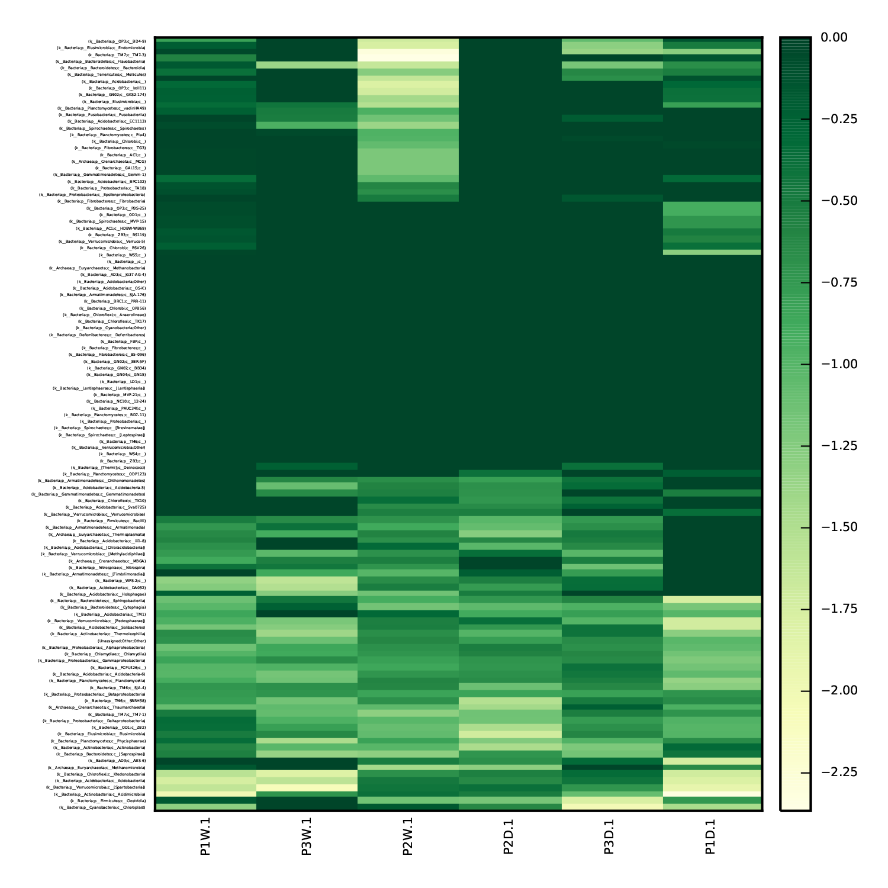
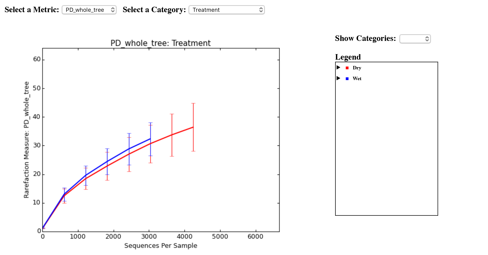
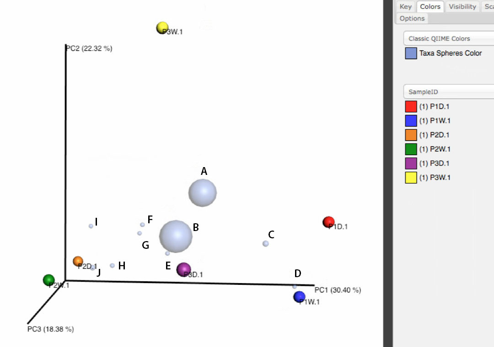

This tutorial was adapted from the [454 Overview Tutorial: de novo OTU picking and diversity analyses using 454 data](http://qiime.org/tutorials/tutorial.html)

###Learning objectives
* Understand the workflow of QIIME
* Understand the input and output files of QIIME
* Generate a heatmap, bar and PCA plot

Data for this tutorial is from the paper by FAC Lopes *et al*.
[Microbial Community Profile and Water Quality in a Protected Area of the Caatinga Biome](http://journals.plos.org/plosone/article?id=10.1371/journal.pone.0148296)
Go here for [data preparation](datapreparation.md) of the NCBI SRA samples.

This QIIME analysis explains how to apply de novo OTU picking and diversity analysis to 16S amplicon data. In 1985, the National Park of Chapada Diamantina (PNCD) was created to prevent environmental degradation. The presence of bacteria capable of pesticide degradation and assimilation, evidencing possible anthropogenic impacts on the Caatinga. The data was collected to evaluate the effect of PNCD protection on the water quality and microbial community diversity of this river by analyzing water samples obtained from points located inside and outside the PNCD in both wet and dry seasons. We will be analyzing the data with a modified workflow for the workshop.

Here is a workflow to follow for the analysis we are going to perform:
(INSERT IMAGE OF WORKFLOW)

#### Getting into your directory
Here we will use commands that we learned in the earlier session to get into the directory (file) that holds our `.fna`, `.qual` and `mapping.txt` files. This directory will hold all files we will be using throughout the analysis. 

The first step is to open 'Terminal.app' by going along the toolbar, its the black box icon. When you open, you will see the following line and a `$`.
```
train12-osx:~ train12$
```
When the terminal is ready, the `$` will be available. What comes in front is the computer and username. Type in `ls`. 
```
train12-osx:~ train12$ ls
16S_analysis	Documents	Movies		Public
Applications	Downloads	Music		QIIME_analysis
Desktop		Library		Pictures
```
Remember that `ls` is list. Anything in your filesystem will be returned. Let's use `ls -lh`:
```
MacQIIME train12-osx:~ $ ls -lh
total 0
drwxrwxr-x   5 train12  tigr   170B May 23 11:05 16S_analysis
drwx------   3 train12  tigr   102B Apr 22 10:50 Applications
drwx------+  6 train12  tigr   204B May 25 23:54 Desktop
drwx------+  4 train12  tigr   136B May 24 22:49 Documents
drwx------+ 12 train12  tigr   408B May 23 16:44 Downloads
drwx------@ 48 train12  tigr   1.6K May 24 10:25 Library
drwx------+  3 train12  tigr   102B Apr 21 12:42 Movies
drwx------+  3 train12  tigr   102B Apr 21 12:42 Music
drwx------+  4 train12  tigr   136B Apr 21 13:18 Pictures
drwxr-xr-x+  5 train12  tigr   170B Apr 21 12:42 Public
drwxrwxr-x   6 train12  tigr   204B May 25 23:53 QIIME_analysis
drwxr-xr-x  19 train12  tigr   646B May 25 23:53 joslynn
MacQIIME train12-osx:~ $ 
```
Remember that you can show the directory and permissions, file types and sizes with the argument `-lh`.

The files we want are located in the `QIIME_analysis` folder. We need to use `cd` aka `change directory` into `QIIME_analysis.`
```
train12-osx:~ train12$ cd QIIME_analysis/
```
There won't be anything displayed. We can use the `ls` command to display what is in the directory.
```
train12-osx:~ train12$ ls
```
What files do you see? Let's see the path directory, type `pwd` (What is that again?)

```
train12-osx:QIIME_analysis $ pwd
/Users/train12/QIIME_analysis
train12-osx:QIIME_analysis $ 
```

Now that we have the files and are in the correct location, we can move on to initialize the program `macqiime`!

#### Step 1. Identifying the version of macqiime
In the paper, under **Materials and Methods** 'Polymerase chain reaction, 16S rRNA gene amplicon sequencing, and sequence analysis' section, the authors analyzed the sequences using QIIME 1.7.0 software. On our computers we will be checking the version of our QIIME. This will impact the availability of certain scripts and parameters. 

To initialize macqiime, type the command:
```
train12$ source /macqiime/configs/bash_profile.txt
```
Do you notice anything different in the prompt?

We can begin to execute a macqiime script `.py` because we initialized macqiime. To check the version, QIIME has its own script to check this. We are going to see the options that come with this script. 

Remember `-h` was used to check the parameters/arguments necessary.
```
MacQIIME train12-osx:QIIME_analysis $ print_qiime_config.py -h
Usage: print_qiime_config.py [options] {}

[] indicates optional input (order unimportant)
{} indicates required input (order unimportant)

Print QIIME configuration details and optionally perform tests of the QIIME base or full install.

Example usage: 
Print help message and exit
 print_qiime_config.py -h

Example 1: Print basic QIIME configuration details
 print_qiime_config.py

Example 2: Print basic QIIME configuration details and test the base QIIME installation
 print_qiime_config.py -t

Example 3: Print basic QIIME configuration details and test the full QIIME installation
 print_qiime_config.py -tf

Options:
  --version             show program's version number and exit
  -h, --help            show this help message and exit
  -v, --verbose         Print information during execution -- useful for
                        debugging [default: False]
  -t, --test            Test the QIIME install and configuration [default:
                        False]
  -f, --qiime_full_install
                        If passed, report on dependencies required for the
                        QIIME full install. To perform tests of the QIIME full
                        install, you must also pass -t. [default: False]
```
We will use Example 2 to check the version and run a test on the installation. Type:
```
MacQIIME train12-osx:QIIME_analysis $ print_qiime_config.py -t
```
Read the output and write down the version. How many tests were performed?

#### Step 2. Validate the format of the mapping file
The important file for this analysis is the mapping file. To ensure it is correctly formatted the script `validate_mapping_file.py` is used. For this script, there are two options:
```
-m Metadata mapping filepath [REQUIRED]
-o Required output directory for log file, corrected mapping file, and html file.
```
The mapping file `watertest_Map.txt` can be found in the folder `QIIME_analysis/`. We need to be sure we are in the file look at what is listed infront of the `$`.
```
MacQIIME train12-osx:QIIME_analysis $
MacQIIME train12-osx:QIIME_analysis $ validate_mapping_file.py -m watertest_Map.txt -o mapping_output
No errors or warnings were found in mapping file.
```
This script will print a message indicating whether or not problems were found in the mapping file. Here there isn't a problem. To view output files, type:
```
MacQIIME train12-osx:QIIME_analysis $ ls mapping_output
```
If there are errors, the HTML file shows the location of errors and warnings and a plain text log file will also be created. Errors will cause fatal problems with subsequent scripts and must be corrected before moving forward. Warnings will not cause fatal problems, but it is encouraged that you fix these problems as they are often indicative of typos in your mapping file. A file ending with _corrected.txt will have a copy of the mapping file with invalid characters replaced by underscores.

#### Step 3. Quality of the reads 
The next step is to assess the quality of the reads coming off the sequencer. The script to use here is `quality_scores_plot.py` which requires the `.qual` file. Here the option/parameter `-q` calls the `.qual`quality scores file and `-o` generates the output directory `quality_histogram`
```
MacQIIME train12-osx:QIIME_analysis $ quality_scores_plot.py -q P1P2P3_rep1_wetdry.qual -o quality_histogram
quality_histogram
Suggested nucleotide truncation position (None if quality score average did not fall below the minimum score parameter): 439
```
The `quality_scores_plot.py` will generate two histograms of sequence quality scores. High-quality read length and abundance are the primary factors differentiating correct from erroneous reads produced by sequencing instruments.

Let's look at the `.pdf` file. This time we will use the graphical user interface (GUI) to view the `quality_scores_plot.pdf`. Open the Macintosh HD icon on the desktop and click on `QIIME_analysis`. Take a look at the plot and note what is on the x- and y-axis.

#### Step 4. Preprocess the sequence reads 
The next task is to assign the reads to samples based on their nucleotide barcode (this is known as demultiplexing). This step also performs quality filtering based on the characteristics of each sequence, removing any low quality or ambiguous reads. The `split_libraries.py` script assign the reads to samples based on their nucleotide barcode, performs quality filtering and removes any low quality or ambiguous reads. Here are the arguments/parameters/options for `split_libraries.py`.
```
Parameter(s):
-b	barcode type, a number representing the length of the barcode, such as -b 4 [REQUIRED in our case]
-m	name of mapping file [REQUIRED]
-f	names of fasta files, comma-delimited [REQUIRED]
-q	names of qual files, comma-delimited
-o	directory prefix for output files
```
After each arguments/parameters/options, you will notice a value needs to be inserted. IF one is forgotten, an error will occur.
```
MacQIIME train12-osx:QIIME_analysis $ split_libraries.py -b -m watertest_Map.txt -f P1P2P3_rep1_wetdry.fna -q P1P2P3_rep1_wetdry.qual -o split_library_output
```
What happened? We needed to specify the barcode number. Use the `ARROW UP` to avoid entering the whole command. Use the shortcut: `CRTL-A` to go to the beginning of the line. `ARROW RIGHT` to go after `-b` to enter `10`. Click enter.
```
MacQIIME train12-osx:QIIME_analysis $ split_libraries.py -b 10 -m watertest_Map.txt -f P1P2P3_rep1_wetdry.fna -q P1P2P3_rep1_wetdry.qual -o split_library_output
```
This will create three files in the new directory `split_library_output/`. To view them let's look into the output file using `cd`:
```
MacQIIME train12-osx:QIIME_analysis $ cd split_library_output/
```
Now we need to list the files. Type in:
```
MacQIIME train12-osx:split_library_output $ ls
histograms.txt        seqs.fna              split_library_log.txt
```
We should see three files:
* `split_library_log.txt `: This file contains the summary of demultiplexing and quality filtering, including the number of reads detected for each sample and a brief summary of any reads that were removed due to quality considerations.
* `histograms.txt`: This tab-delimited file shows the number of reads at regular size intervals before and after splitting the library.
* `seqs.fna`: This is a fasta formatted file where each sequence is renamed according to the sample it came from. The header line also contains the name of the read in the input fasta file and information on any barcode errors that were corrected.

You can use 'less split_library_log.txt' to view the file. `q` to get out. We will need to return to the /QIIME_analysis path.
Type `cd ..`, there is a `SPACE` between `cd` and `..`:

```
MacQIIME train12-osx:split_library_output $ cd .. 
```
#### Step 5. Build an operational taxonomic unit (OTU) table 
At this step, all of the sequences from all of the samples will be clustered into Operational Taxonomic Units (OTUs) based on their sequence similarity. OTUs in QIIME are *clusters of sequences*, frequently intended to represent some degree of taxonomic relatedness. 
* For example, when sequences are clustered at 97% sequence similarity, each resulting cluster is typically thought of as representing a species. 
* Since each OTU may be made up of many related sequences, we will pick a representative sequence from each OTU for downstream analysis. This representative sequence will be used for taxonomic identification of the OTU.
* Next, taxonomy will be assigned to each representative sequence.

The method we will be using to build an OTU is the de novo OTU picking. Here, the reads are clustered against one another without any external reference sequence collection. `de novo OTU picking.py` is the primary interface for de novo OTU picking in QIIME.
```
Parameter(s):
-i	the input fasta file [REQUIRED]
-o 	the output directory [REQUIRED]
```
Enter the following command with necessary inputs:
```
MacQIIME train12-osx:QIIME_analysis $ pick_de_novo_otus.py -i split_library_output/seqs.fna -o otus
```
In the `otus/rep_set/ directory`, QIIME has a fasta file `seqs_rep_set.fasta` containing one representative sequence for each OTU. In this fasta file, the sequence has been renamed with the OTU identifier (`P3W.1_60059/P1D.1_62167`), and the additional information on the header line reflects the sequence used as the representative:

```
>denovo0 P3W.1_60059
TCCACGCCGTAAACGATGAGCACTAGGTGGGTGCCGAGCTATCGGTGCCTGCCGCAGGCAATTTGATAAGTGCTCCGCCTGGGGAGTATGGTCGCAAGGCTGAAACTCAAAGGAATTGACGGGGGCTCACACAAGCGGTGGAGGATGTGGTTTAATTCGAAGCAACGCGCAGAACCTTACCAAGTCTTGACATACCGGGATTAGTTTGGTGAAAGCCAGATGATTTCCAGCAATGGAGTAATCGGAACAGGTGCTGCATGGCTGTCGTCAGCTCGTGCCGTGAGGTGTTAGGTTAAGTCCTTTAACGAGCGAAACCCCTACGATTAGTTACCAGCGCGTAAAGGCGGGAACTCTAGTCGGACTGCCGCGCAAGCAGGAGGAAGGTGGGGACGACGTCAAGTCATCATGGCCTTTATGATTTGGGCCACACACGTCCTACAATGGGTGGTACAAAGGGTTGCAGAACCGCAAGGCGAAGCC
>denovo1 P1D.1_62167
TCCACGCCGTAAACGATGGATGCTAGCCGTTGGTGGGTTTACCCATCAGTGGCGCAGCTAACGCATTAAGCATCCCGCCTGGGGAGTACGGTCGCAAGATTAAAACTCAAAGGAATTGACGGGGGCCCGCACAAGCGGTGGAGCATGTGGTTCAATTCGACGCAACGCGAAGAACCTTACCTGGGCTCGAAATGCAGGAGATCGGGGTGGAAACATCCCTTCCCCTTAAAAGGCTGCTGCATAGGTGCTGCATGGCTGTCGTCAGCTCGTGTCGTGAGATGTTGGGTTAAGTCCCGCAACGAGCGCAACCCTTATCCCTGGTTGCCATCGGGTCAAGCCGGGCACTCTAGTGAAACTGCCTCGGATAACGAGGAGGAAGGTGGGGATGACGTCAAGCCCTCATGGCCTTTATGTCCAGGGCTACACACGTGCTACAATGGTCGGTACAAACCGTCGCGAACCCGTGAGGGAGAGCTAATCGGAAAAAAGCCGGCCTCAGTTCGGATTGGAGT
>denovo10 P3W.1_60050
TCCACGCTGTAAACGATGGTTACTGGACGTTAACTCCGTTATGCGGAGCTAGTGTCGTAGCTAATGCGATAAGTAATCCGCCTGAGTAGTACGGTCGCAAGATTAAAACTCAAAGGGATTGGACGGGGGTCCGCACAAGCGGTGGAACATGTGGTTTAATTCGACACTACGCGAGAAACCTTACCTAGGCTTGACATGTATTTGACTGCTATGGAAACATAGTTTTTATGCGAAAGTATAGACAGATGCACAGGTGCTGCATGGCTGTCGTCAGCTCGTGTCGTGAGATGTTGGGTTAAGTCCTTTAACGAGTCGCAACTCCTGCCACTAGTTGCAACCCAGTGATAGGGGCACGTCTAGGTGGGACTGCCTGGGAAACCAGGAGGAGGCGGAATGACGTCAAGTCCGCATGGTCCTTATGCCTAGGG
>denovo100 P2W.1_11334
```
The table is made and now we need to check it out.

#### Step 6. Summarize sample OTU table/counts 
To view summary statistics of the OTU table, run:
```
MacQIIME train12-osx:QIIME_analysis $ biom summarize-table -i otus/otu_table.biom -o otus/otu_table_stats.txt
```
Let's look at the `otu_table_stats.txt` file to find out more information about. Type in `less`:
```
MacQIIME train12-osx:QIIME_analysis $ less otus/otu_table_stats.txt
```
The first several lines of the `otu_table_stats.txt` have the number of raw input sequences and the total number seqs written. Write down the number of sequences before and after. 

Another line to pay attention to the `Counts/Sample summary` line:
````
Counts/sample summary:
 Min: 3369.0
 Max: 51312.0
 Median: 6069.500
 Mean: 13153.833
 Std. dev.: 17108.171
 Sample Metadata Categories: None provided
 Observation Metadata Categories: taxonomy
```
The median will be important for Step 9. Type `q` to get out of less.

#### Step 7. Summarize communities by taxonomic composition 
You can group OTUs by different taxonomic levels (phylum, class, family, etc.) with the workflow script `summarize_taxa_through_plots.py.` 
**Note that this process depends directly on the method used to assign taxonomic information to OTUs**
Here are the parameters and command:
```
Parameter(s):
-i	the input otu table [REQUIRED]
-o	the output directory [REQUIRED]
-m	path to the mapping file
MacQIIME train12-osx:QIIME_analysis $ summarize_taxa_through_plots.py -i otus/otu_table.biom -m watertest_Map.txt -o taxa_summary
```
The script will generate new tables at various taxonomic levels (we’ll refer to these as taxonomy tables, which are different than OTU tables). For example, the genus-level table is located at `taxa_summary/otu_table_L5.txt` and is Figure 3A from the paper. Each taxonomy table contains the relative abundances of taxa within each sample.

To view the resulting charts, open the area or bar chart html file located in the `taxa_summary/taxa_summary_plots` folder. The following chart shows the taxonomic assignments for each sample as a bar chart. Scroll down to the fifth plot in the `.html`. The kingdom, phylum, class, family, and genus will be listed. Each genus will be a different color. The most abundant is a beige. 
**Place your mouse-over the colors in the plot to see which taxa and the associated percentage**:



Here we will fill out the table with relative percentages in the workbook. Compare these to the results section of the paper and what you wrote in your workbook.

We will open `Excel.app`. We will highlight the text below the figure and paste it into the spreadsheet. We will do a quick sorting of the data using the `sort` function.

#### Step 8. Make a taxonomy heatmap 
QIIME supports generating heatmap images of BIOM tables (e.g., OTU tables or the taxonomy tables generated in the previous step) with `make_otu_heatmap.py`. 

A heat map (or heatmap) is a graphical representation of data where the individual values contained in a matrix are represented as colors. The values are reported through a scale bar.

Let’s create a heatmap illustrating *class-level* abundances on a per-sample basis, where samples are sorted by whether they are from protected area plus wet and dry season:

```
-i	path to the input OTU table (i.e., the output from make_otu_table.py) [REQUIRED]
-c 	Metadata category for sorting samples. Samples will be clustered within each category level using Euclidean UPGMA.
-m	Metadata mapping file to be used for sorting Samples in the heatmap
-o	the output filepath [REQUIRED]

MacQIIME train12-osx:QIIME_analysis $ make_otu_heatmap.py -i taxa_summary/otu_table_L3.biom -c Treatment -m watertest_Map.txt -o taxa_summary/otu_table_L3_heatmap.pdf
```
A PDF file is created as `taxa_summary/otu_table_L3_heatmap.pdf`. The first three samples are from WET season and the last three are from DRY season. This clearly illustrates class-level differences in the taxonomic composition of the samples.



This script visualizes an OTU table as a heatmap where each row (left) corresponds to an OTU and each column corresponds to a sample (bottom). The higher the relative abundance of an OTU in a sample, the more intense the color (yellow) at the corresponsing position in the heatmap.

Compare the profile of`P1D.1` to `P2D.1` and `P3D.1`. Remember which is protected and unprotected.

#### Step 9. Analyzing the OTU table: alpha diversity 
Community ecologists are often interested in computing alpha (or the within-sample) diversity for samples or groups of samples in their study.

To see what measures of alpha diversity will be computed by default, run:
```
MacQIIME train12-osx:QIIME_analysis $ alpha_rarefaction.py -i otus/otu_table.biom -m watertest_Map.txt -t otus/rep_set.tre --retain_intermediate_files -e #### -o arare_intermediate####
```
What was recorded from Step 6 and for the #### put in the number there. The 

To view the alpha rarefaction plots, open the file `arare/alpha_rarefaction_plots/rarefaction_plots.html`. Once the browser window is open, select the `metric PD_whole_tree` and the category `Treatment`, to reveal a plot like the figure below. You can click on the triangle next to each label in the legend to see all the samples that contribute to that category. Below each plot is a table displaying average values for each measure of alpha diversity for each group of samples in the specified category.

Select a metric: `PD_whole_tree` and Select a Category: `Treatment`


#### Step 10. Analyzing the OTU table: beta diversity 
In addition to alpha (or within-sample) diversity, community ecologists are often interested in computing beta (or the between-sample) diversity between all pairs of samples in their study.

Beta diversity represents the explicit comparison of microbial (or other) communities based on their composition. Beta diversity metrics thus assess the differences between microbial communities. The fundamental output of these comparisons is a square, hollow matrix where a “distance” or dissimilarity is calculated between every pair of community samples, reflecting the dissimilarity between those samples. The data in this distance matrix can be visualized with analyses such as Principal Coordinates Analysis (PCoA) and hierarchical clustering.

Here, we will calculate beta diversity between our 3 microbial communities (P1/P2/P3) using the default beta diversity metrics of weighted and unweighted UniFrac, which are phylogenetic measures used extensively in recent microbial community sequencing projects. To perform this analysis, we will use the `beta_diversity_through_plots.py` workflow.

We can run the `beta_diversity_through_plots.py` workflow with the following command, which requires the OTU table (-i) and tree file (-t) from above, the metadata mapping file (-m), and the number of sequences per sample (-e, even sampling depth):

```
MacQIIME train12-osx:QIIME_analysis $ beta_diversity_through_plots.py -i otus/otu_table.biom -m watertest_Map.txt -t otus/rep_set.tre -e 100 -o betadiv_100
```
Beta diversity metrics assess the differences between microbial communities. By default, QIIME calculates both weighted and unweighted UniFrac, which are phylogenetically-aware measures of beta diversity.

The resulting distance matrix `bdiv_even100/unweighted_unifrac_pc.txt` is the basis for further analyses and visualizations.

#### Step 11. Generate 3-D biplots for beta diversity
We can add taxa from the taxonomy tables in the `taxa_summary/` directory to a 3-D PCoA plot using Emperor’s `make_emperor.py`. The coordinates of a given taxon are plotted as a weighted average of the coordinates of all samples, where the weights are the relative abundances of the taxon in the samples. The **size of the sphere representing a taxon** is proportional to the mean relative abundance of the taxon across all samples. The following command creates a biplot displaying the 5 most abundant class-level taxa:
```
MacQIIME train12-osx:QIIME_analysis $ make_emperor.py -i betadiv_100/unweighted_unifrac_pc.txt -m watertest_Map.txt -t taxa_summary/otu_table_L5.txt --n_taxa_to_keep 10 -o biplots_betadiv_taxa10
```
The resulting html file biplots/index.html opens up to `EMPEROR` inside the web browser. Go into the directory and open the `index.html` file. We will compare this to Figure 3C from the paper.



Total relative abundance of taxonomic groups (kingdom, phylum, class, family, and genus -- FILE `otu_table_L5.txt` and lists the 10 taxa using `--n_taxa_to_keep`)

_A. - k__Bacteria;p__Proteobacteria;c__Betaproteobacteria;o__Burkholderiales;Other_ 

B. - k__Bacteria;p__Proteobacteria;c__Betaproteobacteria;o__Burkholderiales;f__Comamonadaceae

C. - k__Bacteria;p__Proteobacteria;c__Betaproteobacteria;o__Burkholderiales;f__Oxalobacteraceae

D. - k__Bacteria;p__Proteobacteria;c__Betaproteobacteria;o__Rhodocyclales;f__Rhodocyclaceae

_E. - Unassigned;Other;Other;Other;Other_

F. - k__Bacteria;p__Proteobacteria;c__Betaproteobacteria;o__Methylophilales;f__Methylophilaceae

G. - k__Bacteria;p__Proteobacteria;c__Alphaproteobacteria;o__Sphingomonadales;f__Sphingomonadaceae

H. - k__Bacteria;p__Acidobacteria;c__Acidobacteriia;o__Acidobacteriales;f__Koribacteraceae

I. - k__Bacteria;p__Actinobacteria;c__Acidimicrobiia;o__Acidimicrobiales;f__

J. - k__Bacteria;p__Verrucomicrobia;c__[Spartobacteria];o__[Chthoniobacterales];f__[Chthoniobacteraceae]

Questions to answer:

Do we see any P1, P2 and P3 samples grouping together?

Do we find similar bacteria grouping together?
